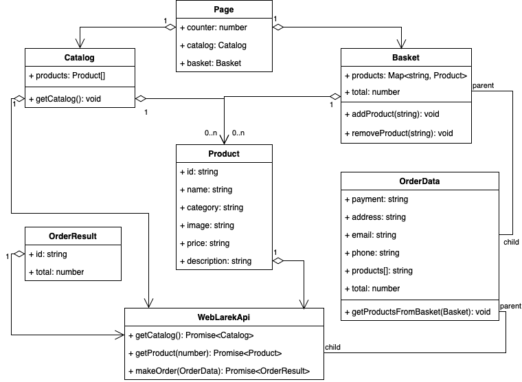

# Проектная работа "Веб-ларек"

Стек: HTML, SCSS, TS, Webpack

Структура проекта:
- src/ — исходные файлы проекта
- src/components/ — папка с JS компонентами
- src/components/base/ — папка с базовым кодом

Важные файлы:
- src/pages/index.html — HTML-файл главной страницы
- src/types/ — папка с типами
- src/index.ts — точка входа приложения
- src/scss/styles.scss — корневой файл стилей
- src/utils/constants.ts — файл с константами
- src/utils/utils.ts — файл с утилитами

## Архитектура системы, основные сущности  

### 1. **Catalog**  
- Хранит информацию о доступных товарах.  
- Связан с **Basket** (корзиной), где товары добавляются пользователем.  

### 2. **Basket**  
- Содержит товары, которые пользователь выбрал для покупки.  
- Может включать несколько товаров из каталога.  
- Является **родительским** объектом для **OrderData**.  

### 3. **OrderData**  
- Содержит информацию о заказе после его оформления.  
- Является **дочерним** объектом для **Basket**.  
---
### Взаимодействие сущностей  
- **Catalog ↔ Basket**: Пользователь добавляет товары в корзину.  
- **Basket ↔ OrderData**: После оформления заказа данные передаются в объект **OrderData**. 

## UML-диаграмма
Ниже представлена архитектура проекта


## Установка и запуск
Для установки и запуска проекта необходимо выполнить команды

```
npm install
npm run start
```

или

```
yarn
yarn start
```
## Сборка

```
npm run build
```

или

```
yarn build
```
